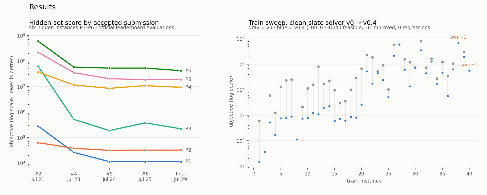
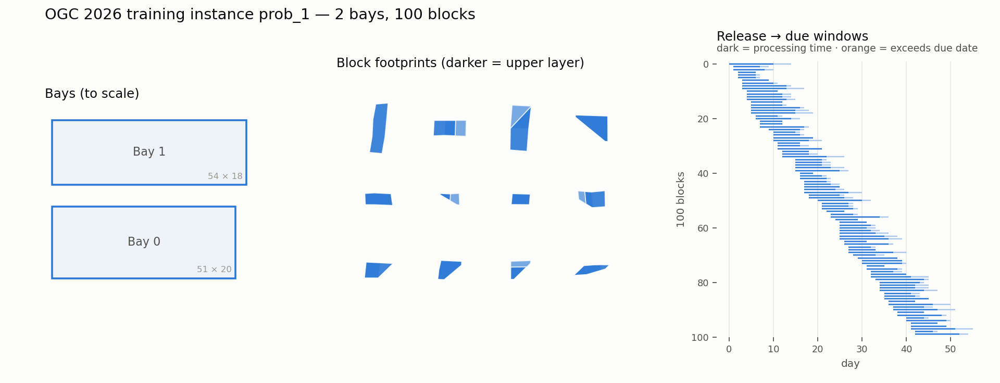
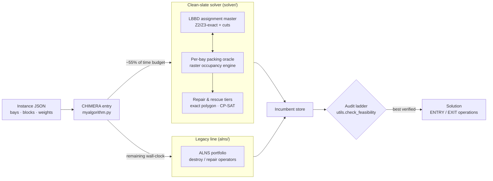

<div align="center">

# The Grand Shipyard Puzzle
### Optimization Grand Challenge 2026 — Team SANDLE

*A hybrid exact/metaheuristic solver for spatial block scheduling in shipyard bays:*
*irregular 3D polygonal packing × machine scheduling, under a hard 60-second budget.*


</div>

---

## Impact at a glance

| | |
|---|---|
| **Objective reduction** | **1–2 orders of magnitude** on the official hidden evaluation set over four submission cycles (P3: 61.6M → 187K, −99.7%) |
| **Reliability** | **100% feasibility** — zero rejected solutions across every accepted evaluation and all 40 training instances |
| **Optimality** | Proven-optimal certificates on structured instances (LBBD master bound closed); certified lower bounds elsewhere |
| **Robustness** | Entry point engineered to **never crash, never time out, never return unverified work** — hard watchdogs, process-group kills, audited fallbacks |



## The problem



A shipyard has `m` fixed rectangular bays. Each of `n` ship blocks is a 3D
object made of stacked polygonal (possibly non-convex) layers, with a release
date, processing time, due date, workload, and per-bay preference scores. For
every block the algorithm must simultaneously decide:

1. **which bay** it goes to,
2. its **position and orientation** inside the bay,
3. its **ENTRY day**, and
4. its **EXIT day**,

such that blocks never overlap in space while co-resident in a bay. The
objective blends tardiness (Z1), workload balance across bays (Z2), and bay
preference (Z3) — so every placement decision couples a hard geometric packing
problem with a scheduling problem. One instance, one process, **60 seconds**.
Full formal statement: [`ogc2026/problem-statement.pdf`](ogc2026/problem-statement.pdf).

## Solution architecture — "CHIMERA"

Two independently engineered solver lines run inside one time budget; the best
*independently verified* result wins per instance:



**Line 1 — exact-flavored matheuristic** (`solver/`): logic-based Benders
decomposition. A Z2/Z3-exact assignment master generates bay assignments;
per-bay packing oracles running on a conservative-raster spatio-temporal
occupancy engine either certify them or return cuts. Project-and-repair sits
inside the oracle; exact-polygon and CP-SAT rescue tiers recover what the
raster abstraction loses. On structured instances the master bound *closes* —
the solution ships with an optimality certificate.

**Line 2 — adaptive large neighborhood search** (`alns/`): a destroy/repair
operator portfolio, kept byte-for-byte stable as the hedge for instance
classes the newer pipeline has never seen. The hidden set is not the training
set — the architecture prices that in.

**The audit ladder**: nothing reaches the output without passing the official
feasibility checker *in the parent process, on the exact dict being returned*.
A verified incumbent always outranks an unverified one; if the ladder is empty,
a last-resort feasible construction is built and audited inside a reserved
time tail. The entry point never raises and never returns `None`.

## Results

### Official hidden-set evaluations

Submissions are scored by the organizers on **six hidden instances (P1–P6)**,
disjoint from the 40 published training instances. Four submissions were
accepted; every accepted run returned a feasible solution on all six instances.
Best score per instance in **bold**:

| Submission | Date (UTC) | P1 | P2 | P3 | P4 | P5 | P6 |
|---|---|---:|---:|---:|---:|---:|---:|
| #2 — first accepted | Jul 21 | 280,494 | 62,696 | 61,634,834 | 36,957,614 | 220,176,080 | 601,627,045 |
| #4 | Jul 23 | 26,150 | 37,748 | 515,798 | 11,570,444 | 34,867,084 | 57,616,192 |
| #5 — frozen hedge | Jul 24 | **11,280** | **31,368** | **186,910** | **8,462,228** | 20,226,241 | **52,808,786** |
| #6 — CHIMERA (standing) | Jul 25 | **11,280** | 32,068 | 376,241 | 10,854,126 | **18,630,178** | 52,828,500 |

From the first accepted submission to the best score: **−96% (P1), −50% (P2),
−99.7% (P3), −77% (P4), −92% (P5), −91% (P6)**. The per-instance winners split
between the last two entries — the frozen hedge leads on four instances, the
CHIMERA entry improved a fifth — exactly the trade-off the two-line
architecture was designed to navigate.

### Train-set benchmark (40 instances, 60 s limit)

The clean-slate solver's v0 → v0.4 (LBBD cut loop) progression, measured under
a fixed protocol (one subprocess per instance, hard external timeout, verdict
by the official checker only — never the solver's own claim):

- **40/40 feasible, zero failures** — v0's hard timeouts on prob_38/40
  eliminated; worst wall-clock 52.03 s against a 54.8 s internal budget.
- vs v0: **36 improved, 2 fixed from infeasible, 2 exact ties, 0 regressions**;
  median improvement on changed instances ≈ **−80%**.
- **prob_4 solved to proven optimality**; three instances stop at a certified
  optimum in under 3 seconds instead of idling out the budget.

## Engineering rigor

The part that doesn't show up in a score table:

- **Measurement discipline.** Every benchmark in
  [`ogc2026/baseline/results/`](ogc2026/baseline/results/) is a stamped report:
  git commit, environment, machine-load telemetry, N per instance, and
  explicit provenance caveats. Timing-sensitive claims required N≥5 reps;
  single-rep numbers are labeled indicative, never shippable evidence.
- **Adversarial gating.** Submission candidates passed a submit-safety
  gauntlet that hunted for failure classes — it caught two distinct
  time-limit-overrun bugs pre-submission (one requiring a forked process
  group with a hard SIGKILL watchdog, because the legacy seed construction
  was non-preemptible).
- **Trust boundaries.** The solver's internal claims are never trusted: the
  official feasibility checker is the only oracle, run in the parent on the
  exact object returned. A checker crash is treated as "unknown," ranked
  below any verified result.
- **Hedged deployment.** The previous known-good submission stayed frozen and
  byte-identical as a fallback line inside the new entry — regression risk on
  unseen instance classes was priced in, not hoped away.

## What this project demonstrates

**Optimization:** logic-based Benders decomposition · MIP assignment models ·
CP-SAT repair · ALNS metaheuristics · computational geometry (non-convex
polygon packing, raster occupancy engines) · bound certification.

**Engineering:** hard real-time budget governance · subprocess isolation and
watchdogs · reproducible benchmarking · failure-mode hunting · risk-hedged
release management.

## Repository guide

| Path | Contents |
|---|---|
| `ogc2026/SANDLE_FINAL_SUBMISSION/` | Final submitted algorithm (entry + solver + ALNS lines) |
| `ogc2026/baseline/` | Development working copies and the stamped results archive |
| `ogc2026/baseline/results/` | Lab reports: sweeps, A/B audits, submission lineage |
| `ogc2026/alg_tester/` | Official algorithm tester app (PyQt UI) |
| `ogc2026/rig/` | Linux benchmark rig: full-train gauntlet + forced-kill tests |
| `docs/` | README figures and the scripts that generate them |
| `train/`, `past/` | Training instances & prior editions — local-only, not in this repo |

## Reproduce

```bash
conda env create -f ogc2026/ogc2026_env.yml   # Miniforge recommended
conda activate ogc2026

# interactive tester (official tool)
cd ogc2026/alg_tester && python alg_tester_app.py

# full 40-instance gauntlet on Linux (~85 min): see ogc2026/rig/RIG_SETUP.md
```

---

<div align="center">
<sub>Team SANDLE · Optimization Grand Challenge 2026 · built by Jungwoo Suh</sub>
</div>
