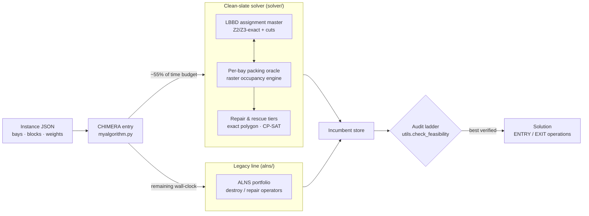

# OGC 2026 — The Grand Shipyard Puzzle

**Team SANDLE** · Python 3.12 · OR-Tools CP-SAT · Gurobi · Xpress

Solution repository for the **Optimization Grand Challenge 2026** ("Pack the
Block, Beat the Clock"), a spatial block scheduling problem from shipbuilding.


## The problem

A shipyard has `m` fixed rectangular bays. Each of `n` ship blocks is a 3D
object made of stacked polygonal (possibly non-convex) layers, with a release
date, processing time, due date, workload, and per-bay preference scores. For
every block the algorithm must simultaneously decide:

1. which bay it goes to,
2. its position and orientation inside the bay,
3. its ENTRY day, and
4. its EXIT day,

such that blocks never overlap in space while co-resident in a bay. The
objective combines tardiness, workload balance across bays, and bay
preference (Z1/Z2/Z3). Full details in
[`ogc2026/problem-statement.pdf`](ogc2026/problem-statement.pdf).

## Repository layout

| Path | Contents |
|---|---|
| `ogc2026/SANDLE_FINAL_SUBMISSION/` | Final submitted algorithm (team SANDLE) |
| `ogc2026/baseline/` | Working copies of the algorithm during development (`sub/`, `SANDLE/`, `solver/`, `alns/`) |
| `ogc2026/alg_tester/` | Official algorithm tester app (PyQt UI) |
| `ogc2026/rig/` | Linux benchmark rig: full-train "gauntlet" runs and forced-kill tests |
| `train/` | 40 official training instances (`prob_1.json` … `prob_40.json`) — local-only, not in this repo |
| `past/` | Materials from the 2024/2025 editions — local-only, not in this repo |

## Solution approach — "CHIMERA"

The entry point `myalgorithm.py` runs **two independent solver lines** and
returns the best *verified* result per instance:



1. **Clean-slate solver** (`solver/`) — an LBBD two-level matheuristic:
   a Z2/Z3-exact assignment master with Benders-style cuts over per-bay
   packing oracles, running on a conservative-raster spatio-temporal
   occupancy engine, with project-and-repair as the inner oracle layer and
   exact-polygon rescue tiers. Gets ~55% of the time budget.
2. **Legacy ALNS portfolio** (`alns/` via `legacy_entry.py`) — adaptive
   large-neighborhood search; the hedge for instance classes the new
   pipeline has never seen. Inherits all remaining wall-clock.

Every candidate passes through a single parent-side audit ladder
(`utils.check_feasibility` on the exact dict about to be returned); an
audited feasible incumbent is always preferred, with a last-resort audited
serial construction built inside a reserved time tail. The algorithm never
raises and never returns `None`.

## Setup

```bash
conda env create -f ogc2026/ogc2026_env.yml   # Miniforge recommended
conda activate ogc2026
```

Python 3.12 with OR-Tools (CP-SAT), Gurobi, Xpress, NumPy/SciPy/Numba,
Shapely, and PyQt6 for the tester UI.

## Running

Test an algorithm interactively with the official tester:

```bash
conda activate ogc2026
cd ogc2026/alg_tester
python alg_tester_app.py
```

Run the full 40-instance benchmark gauntlet on a Linux box (≥4 cores,
≥16 GB RAM, ~85 min): see [`ogc2026/rig/RIG_SETUP.md`](ogc2026/rig/RIG_SETUP.md).
