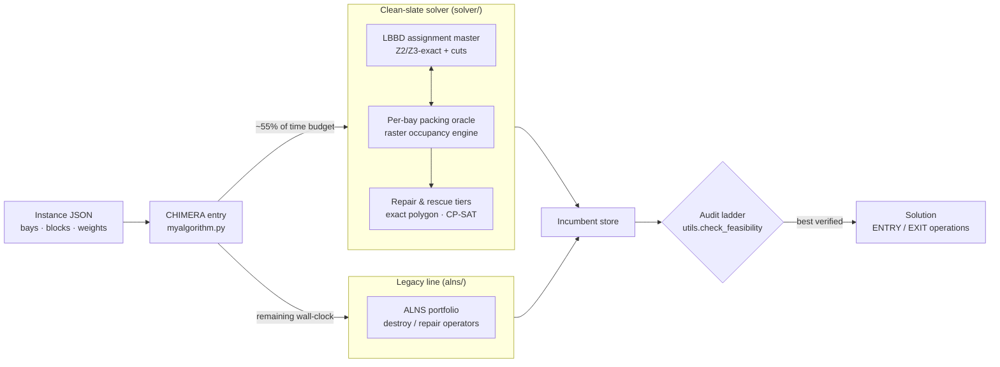

# OGC 2026 — The Grand Shipyard Puzzle

**Team SANDLE** · Python 3.12 · OR-Tools CP-SAT · Gurobi · Xpress

Solution repository for the **Optimization Grand Challenge 2026** ("Pack the
Block, Beat the Clock"), a spatial block scheduling problem from shipbuilding.


## The problem

A shipyard has `m` fixed rectangular bays. Each of `n` ship blocks is a 3D
object made of stacked polygonal (possibly non-convex) layers, with a release
date, processing time, due date, workload, and per-bay preference scores. For
every block the algorithm must simultaneously decide:

1. which bay it goes to,
2. its position and orientation inside the bay,
3. its ENTRY day, and
4. its EXIT day,

such that blocks never overlap in space while co-resident in a bay. The
objective combines tardiness, workload balance across bays, and bay
preference (Z1/Z2/Z3). Full details in
[`ogc2026/problem-statement.pdf`](ogc2026/problem-statement.pdf).

## Repository layout

| Path | Contents |
|---|---|
| `ogc2026/SANDLE_FINAL_SUBMISSION/` | Final submitted algorithm (team SANDLE) |
| `ogc2026/baseline/` | Working copies of the algorithm during development (`sub/`, `SANDLE/`, `solver/`, `alns/`) |
| `ogc2026/alg_tester/` | Official algorithm tester app (PyQt UI) |
| `ogc2026/rig/` | Linux benchmark rig: full-train "gauntlet" runs and forced-kill tests |
| `train/` | 40 official training instances (`prob_1.json` … `prob_40.json`) — local-only, not in this repo |
| `past/` | Materials from the 2024/2025 editions — local-only, not in this repo |

## Solution approach — "CHIMERA"

The entry point `myalgorithm.py` runs **two independent solver lines** and
returns the best *verified* result per instance:



1. **Clean-slate solver** (`solver/`) — an LBBD two-level matheuristic:
   a Z2/Z3-exact assignment master with Benders-style cuts over per-bay
   packing oracles, running on a conservative-raster spatio-temporal
   occupancy engine, with project-and-repair as the inner oracle layer and
   exact-polygon rescue tiers. Gets ~55% of the time budget.
2. **Legacy ALNS portfolio** (`alns/` via `legacy_entry.py`) — adaptive
   large-neighborhood search; the hedge for instance classes the new
   pipeline has never seen. Inherits all remaining wall-clock.

Every candidate passes through a single parent-side audit ladder
(`utils.check_feasibility` on the exact dict about to be returned); an
audited feasible incumbent is always preferred, with a last-resort audited
serial construction built inside a reserved time tail. The algorithm never
raises and never returns `None`.

## Results


### Official hidden-set evaluations

Submissions are scored by the organizers on **six hidden instances (P1–P6)**,
disjoint from the 40 published training instances. Four submissions were
accepted; every accepted run returned a feasible solution on all six instances
(zero `−1` in the lineage). Best score per instance in **bold**:

| Submission | Date (UTC) | P1 | P2 | P3 | P4 | P5 | P6 |
|---|---|---:|---:|---:|---:|---:|---:|
| #2 — first accepted | Jul 21 | 280,494 | 62,696 | 61,634,834 | 36,957,614 | 220,176,080 | 601,627,045 |
| #4 | Jul 23 | 26,150 | 37,748 | 515,798 | 11,570,444 | 34,867,084 | 57,616,192 |
| #5 — frozen hedge | Jul 24 | **11,280** | **31,368** | **186,910** | **8,462,228** | 20,226,241 | **52,808,786** |
| #6 — CHIMERA (standing) | Jul 25 | **11,280** | 32,068 | 376,241 | 10,854,126 | **18,630,178** | 52,828,500 |

From the first accepted submission to the best score, the objective fell by
**~96% on P1, ~50% on P2, ~99.7% on P3, ~77% on P4, ~92% on P5, and ~91% on
P6** — one to two orders of magnitude on four of the six instances. The
per-instance winners split between the last two entries: the frozen
submission #5 still leads on P2/P3/P4/P6, while the CHIMERA entry improved
P5 — precisely the hedging trade-off the two-line architecture was built
around.

### Train-set benchmark (40 instances, 60 s time limit)

The clean-slate solver's v0 → v0.4 (LBBD cut loop) progression on the full
training set, measured under the standing protocol (one subprocess per
instance, hard external timeout, verdict by `utils.check_feasibility` only):

- **40/40 feasible, zero `−1`** — v0's hard timeouts on prob_38/40 are gone;
  worst wall-clock 52.03 s against the 54.8 s internal budget.
- vs v0: **36 instances improved, 2 fixed from infeasible, 2 exact ties,
  0 regressions**; median improvement on changed instances ≈ **−80%**.
- **prob_4 solved to proven optimality** (`master_bound_closed`), and
  prob_1/2/8 stop at a certified assignment-layer optimum in under 3 s.
- Easy tier (prob_1–8) reaches zero tardiness everywhere; the overloaded
  tail (prob_21–40) is dominated by repair and run-to-run timing variance
  (single-rep rows are indicative, not reproducible).

Full stamped lab reports — per-run CSVs, provenance caveats, submit-safety
panels, and A/B audits — live in
[`ogc2026/baseline/results/`](ogc2026/baseline/results/).

## Setup

```bash
conda env create -f ogc2026/ogc2026_env.yml   # Miniforge recommended
conda activate ogc2026
```

Python 3.12 with OR-Tools (CP-SAT), Gurobi, Xpress, NumPy/SciPy/Numba,
Shapely, and PyQt6 for the tester UI.

## Running

Test an algorithm interactively with the official tester:

```bash
conda activate ogc2026
cd ogc2026/alg_tester
python alg_tester_app.py
```

Run the full 40-instance benchmark gauntlet on a Linux box (≥4 cores,
≥16 GB RAM, ~85 min): see [`ogc2026/rig/RIG_SETUP.md`](ogc2026/rig/RIG_SETUP.md).
